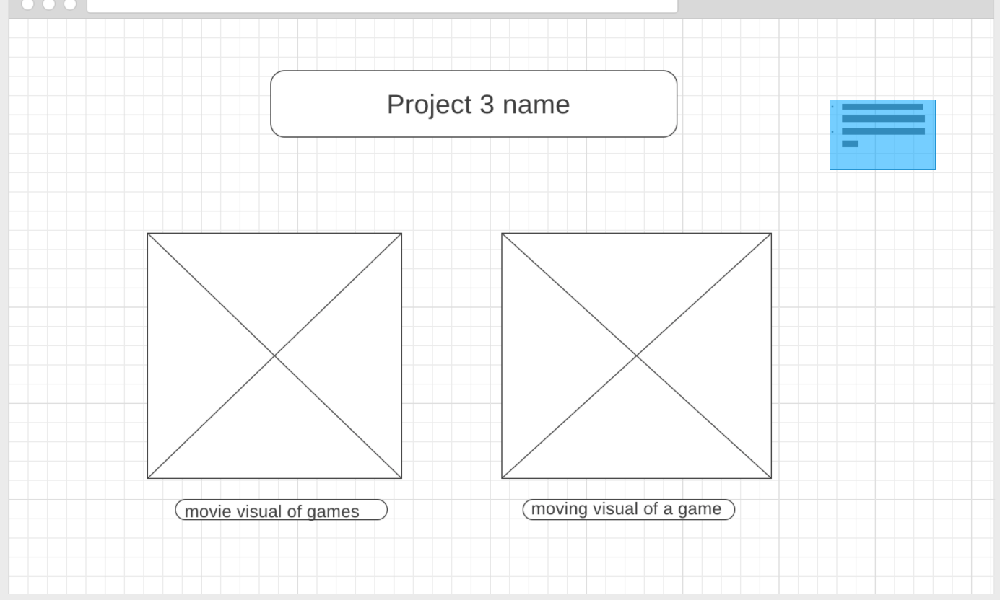
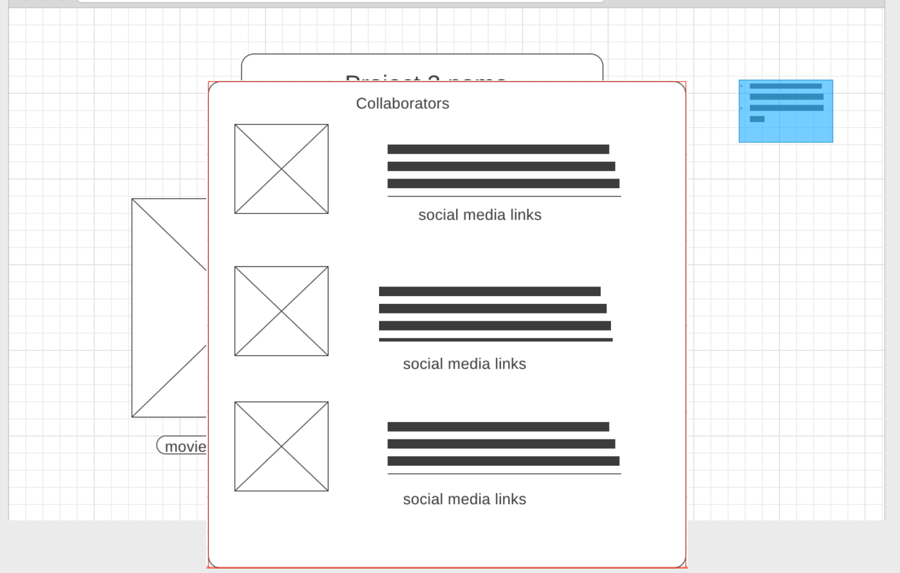
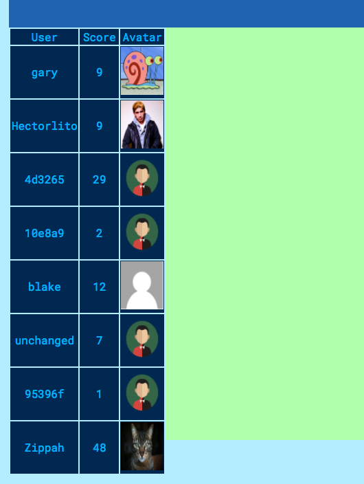
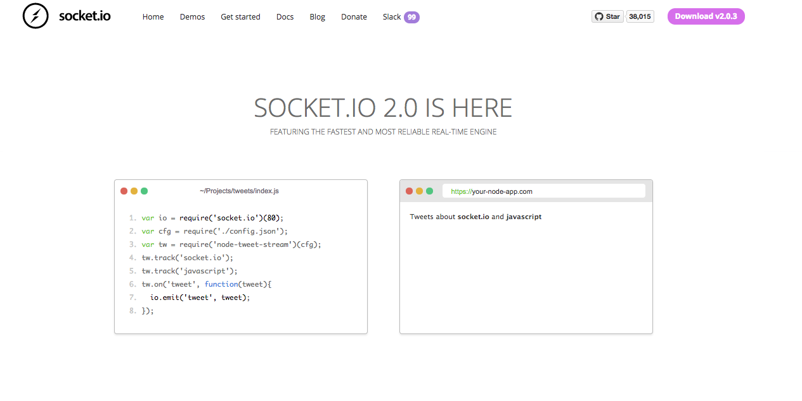

# Profile-Games
- Profile Games is a site with (multiplayer) games that are customized to your profile!
- The site will use your user information inside of some premade games...
- Such as using your profile picture on your avatar or using your profile name on leaderboards.

### Deployment

Heroku is a cloud platform that was used to host our web application. To view live, visit https://profile-games.herokuapp.com/

### Utilizing
 - MongoDB/Mongoose
 - Express
 - Node
 - Angular
 - HTML
 - CSS
 - JavaScript
 - jQuery
 - Socket.io
 - Atom
 - Invision

### Approach

We used a variety approaches because we each worked on different aspects of the game. One of the first things accomplished was a vision for the page and how things would link up.

Main page Layout

Clicking to make nav bar populate

Register and login

About us

Then we continued with creating the routes and the game.

Users playing

We wanted the game to be able to integrate with the accounts populated on the page, so if you log in you can see your name and avatar populated. But we allowed access to anyone who didn't register to play the game as well.

Socket.IO

It was built using a realtime engine called SOCKET.IO which allowed us to implement certain features such as live chat and multiplayer gaming.

## Features

### Registration
Registration allows you to add a custom avatar as well as view all the other players. The game is still playable without registering, but you may miss out on exclusive content!

### Contact Us
You are able to add your email and a brief message.

### Create:
 - User
 - Profile
 - Live chat during a game (if multiplayer)

### Read:
 - All user profiles
 - All games
 - All live chat during a game

### Update:
 - Edit user profile information
 - Edit live chat

### Delete:
 - Your own account

## Contributors
#### Jaq Dunham https://github.com/goodbye-angel
#### Blake Harris https://github.com/harrisblake85
#### Hector Guevara https://github.com/hectorlito

### Future Goals
- More games
- More options for profile customization
- Being able to view profiles when clicking on a player in the "all players" view
- Client awareness depending on the screen size proportions and how that affects other gamers
